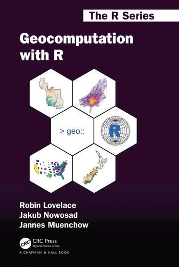
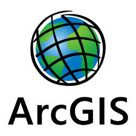
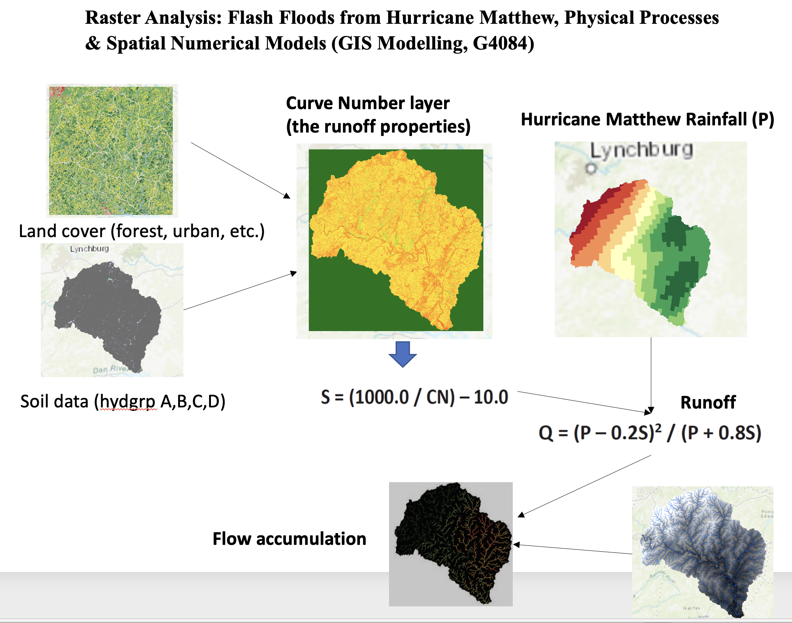
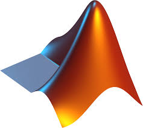
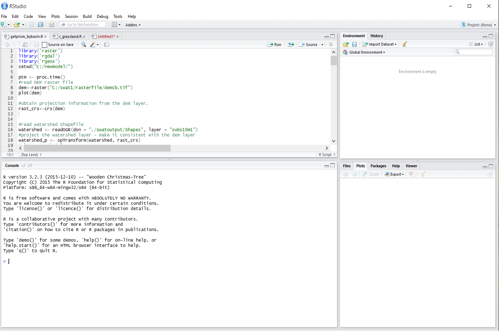
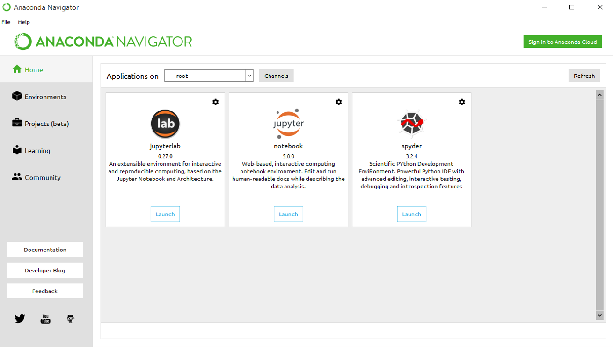
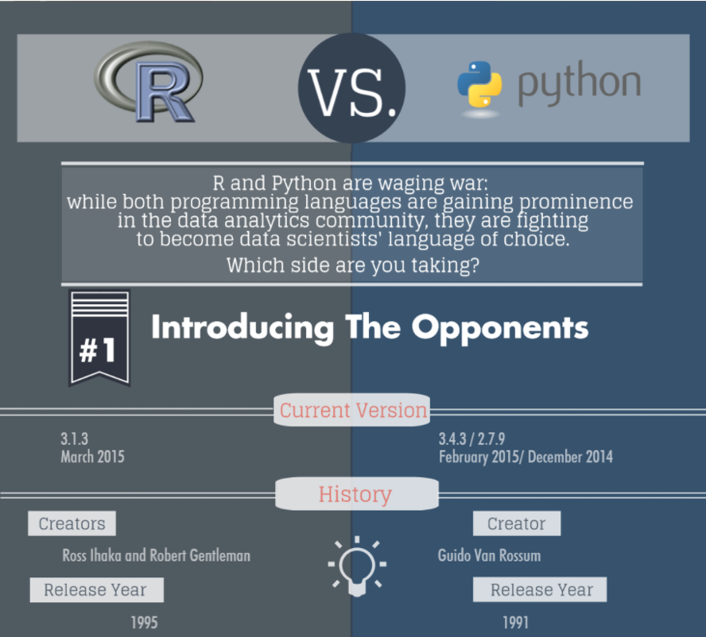
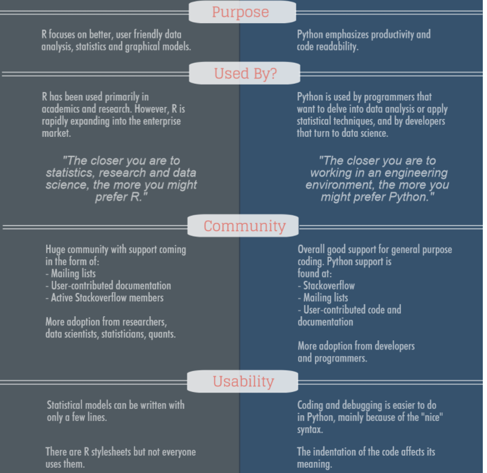
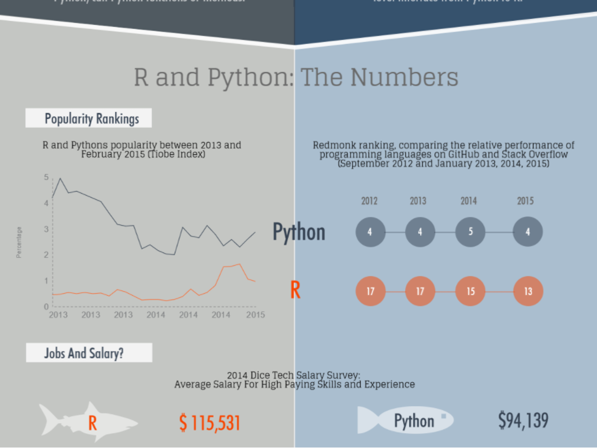

```{r setup, include=FALSE}
knitr::opts_chunk$set(echo = FALSE)
```

## The format of this course
- **Lectures and Lab sessions**
- **Office Hours: Wednesday 3:30PM-4:30PM**

- **Grading:**
 
  -Labs and assignments - 75%
 
  -Midterm exam (or project) - 10%
 
  -Final project – 15%

## Recommended Materials: 
 
*-An Introduction to R for Spatial Analysis and Mapping*


*-Geocomputation with R (Lovelace et al.)*

https://r.geocompx.org


## R for Geospatial Computing (https://r.geocompx.org)



## The format of this course

### Lectures (include Demos and In class exercises) 
<br><br> <!-- Adds extra space -->

### Labs 
I’ll highlight key components of each lab and provide some demos on R programming; Each week I’ll have office hours for additional support (zoom?)

## Tentative topics and schedule
```{r table, echo=FALSE, message=FALSE, warning=FALSE}
suppressMessages({
  library(knitr)
  library(dplyr)
})

# Create the schedule data frame
schedule <- data.frame(
  Week = c("Week 1", "Week 2", "Week 3", "Week 4", "Week 5", "Week 6", "Week 7", "Week 8", "Week 9", "Week 10", "Week 11", "Week 12", "Week 13", "Week 14", "Week 15", "Week 16"),
  Dates = c(
    "Aug 25 - Aug 31", "Sep 1 - Sep 7", "Sep 8 - Sep 14", "Sep 15 - Sep 21", "Sep 22 - Sep 28", 
    "Sep 29 - Oct 5", "Oct 6 - Oct 12", "Oct 13 - Oct 19", "Oct 20 - Oct 26", "Oct 27 - Nov 2", 
    "Nov 3 - Nov 9", "Nov 10 - Nov 16", "Nov 17 - Nov 23", "Nov 24 - Nov 30", "Dec 1 - Dec 7", "Dec 8 - Dec 14"
  ),
  Topics = c(
    "Course introduction; R vs. Python vs. Matlab; R Data types; Data frame; Simple plots in R",
    "Read and write geospatial data using R libraries: sf and terra; Projections (Re-project shapefile, re-project raster); Handling spatial data in R (select by attributes, select by location, summary statistics)",
    "Handling spatial data in R (join, buffer, union, Spatial subsetting, raster calculator, zonal statistics; DEM-derivatives)",
    "Create maps in R",
    "R Scripts; Loops and repetition; Conditional Element Selection; Build your R functions",
    "Remote sensing image classification using Random Forest algorithm",
    "Remote sensing image classification; cross-validation; caret package",
    "Regression analysis; Logistic regression",
    "Time-series analysis",
    "Linux environment; R in high-performance computing environment; VT-ARC",
    "Linux environment; R in high-performance computing environment; VT-ARC",
    "Spatial point pattern analysis; Principal components",
    "R for web app; Shiny app",
    "Thanksgiving holiday",
    "Final project (group presentation)",
    "Final project (group presentation)"
  ),
  Labs = c(
    "Install R and RStudio",
    "Lab 1: R fundamentals",
    "Lab 2: Characterizing Wildland–Urban Interface in Virginia (Rscript)",
    "Lab 3: Fire Fuel Mapping and Modeling in a Forested Environment (Rscript)",
    "Lab 4: Working with census data",
    "Lab 5: Image classification with R",
    "Lab 5: Image classification with R",
    "Lab 6: logistic regression for urban growth simulation",
    "Lab 6: logistic regression for urban growth simulation",
    "Lab 7: Getting started with high-performance computing (VT-ARC)",
    "Lab 7: Getting started with high-performance computing (VT-ARC)",
    "Lab 8: Spatial stats",
    "Final project help session",
    "NA",
    "Final project help session",
    "Final project (group presentation)"
  )
)

# Create the table with knitr::kable
kable(schedule, caption = "")
```

## lab assignments 

```{r table1, echo=FALSE, message=FALSE, warning=FALSE}
suppressMessages({
  library(knitr)
  library(dplyr)
})

# Create the R fundamentals data frame
r_fundamentals <- data.frame(
  Topic = c(
    "r_fundamentals",
    "Characterizing Wildland–Urban Interface in Virginia (Rscript)", 
    "Fire Fuel Mapping and Modeling in a Forested Environment (Rscript)", 
    "Working with census data",
    "Landsat Image classification with R",
    "Logistic regression for urban growth simulation",
    "Getting started with high-performance computing (VT ARC)",
    "Spatial stats"
  )
)

# Create the table with knitr::kable
kable(r_fundamentals, caption = "")
```

## Midterm Exam and Final Project

### Midterm Exam (or Project)
All based on labs and in-class exercises.

### Final Project
Presentation only.

## Software considerations


## Software considerations


## How to succeed in this course
### Follow lectures and labs consistently

### If something is not clear, ask a question

### Clarify expectations with the instructor


## Why R for Geospatial Computing?

<span style="font-size:8px">-Comprehensive Statistical and Analytical Tools</span>

<span style="font-size:8px">-Extensive Package Ecosystem: R has a wide range of packages tailored for spatial data analysis, such as sf, terra, and raster.</span>

<span style="font-size:8px">-Statistical Analysis: R is renowned for its statistical capabilities, making it ideal for geospatial analysis where statistical methods are often applied.</span>

<span style="font-size:8px">-Reproducibility: R scripts and R Markdown documents promote reproducible research, ensuring that analyses can be reproduced and verified by others.</span>

## Spatial analysis, workflow, and Reproducibility


## Why R for Geospatial Computing?
### Handling Large Datasets
<span style="font-size:20px">R is equipped with powerful tools and packages like `data.table` and `dplyr` that allow for efficient manipulation and analysis of large datasets.</span>

### R provides robust looping and iteration constructs
<span style="font-size:20px">for loops, while loops, and the apply family of functions for efficient data processing.</span>

### <span style="font-size:20px">R supports functional programming paradigms</span>
create and apply functions over data structures efficiently.


## R/Python/Matlab
### Freely available
### Widely used in the stats, bioinformatics, data science communities 
### Numerous functions and libraries 
### R GIS developer (many job opportunities)


## R/Python/Matlab
### Freely available
### Widely used in the machine learning, data science (including geospatial) communities
### Numerous functions and libraries 
### Python GIS Developer (many job opportunities)


## R/Python/Matlab
### A high-productivity development environment
### Extensive toolboxes and apps
### Faster performance and easy deployment
### License, expensive 


## Integrated development environment for R


## Integrated development environment for Python


## Integrated development environment for Matlab


## R vs. Python for data analysis
Origin of R - the S language for data analysis and statistics at Bell Laboratories in the 1980s




## R vs. Python for data analysis


## Salary Trends


## R for geospatial data analysis 
### With sf, terra, tidyverse, mapview, and many other functions and libraries, R can be considered as Integrated GIS/RS development environment

<span style="font-size:10px">
- **Download geospatial data (USGS gauges, climate data, land cover, dem ……)**

- **Import/export various GIS files**

- **Spatial analysis with GIS: buffer, select by attributes, select by location, overlay, clipping, zonal statistics, re-project, summary statistics, point-in-polygon analysis, kernel density, distance analysis, raster reclassification, vector to raster conversion, raster to vector conversion, terrain analysis, advanced spatial statistics, image classification, ….**

- **Statistical analysis and machine learning (numerous packages), simulation models**

- **R visualizations**</span>

