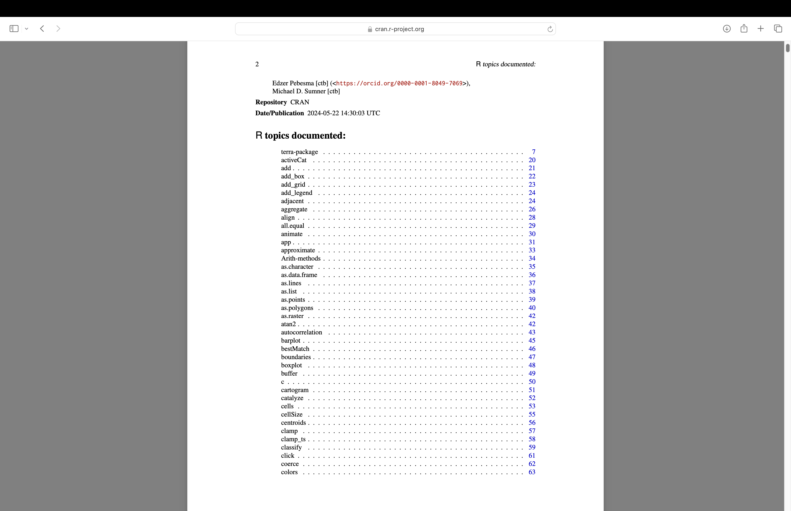
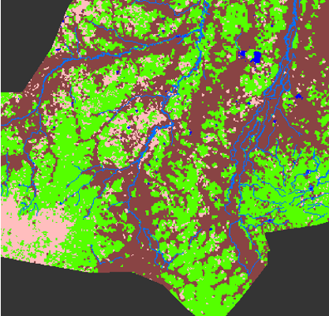
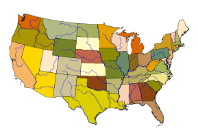
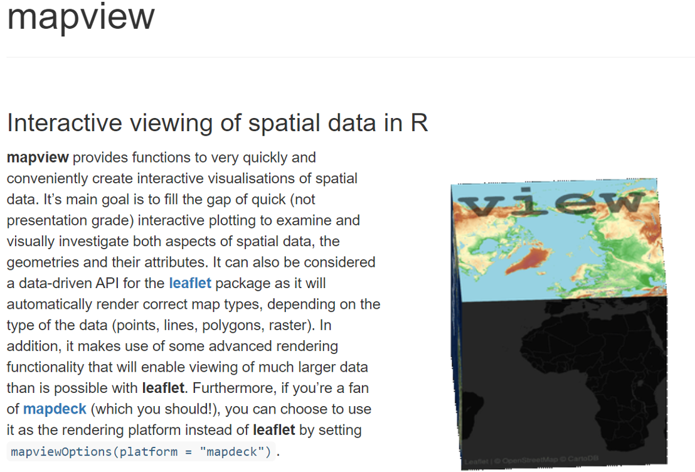
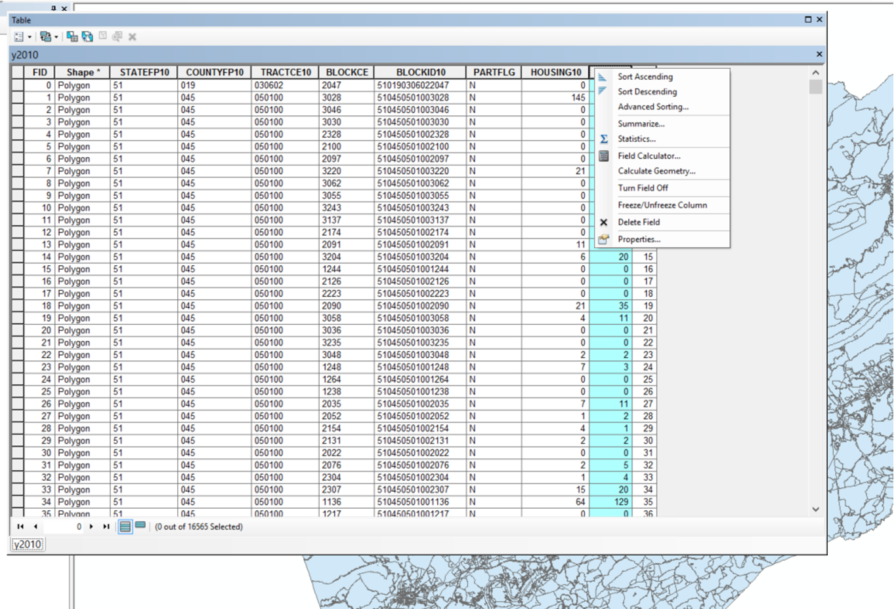
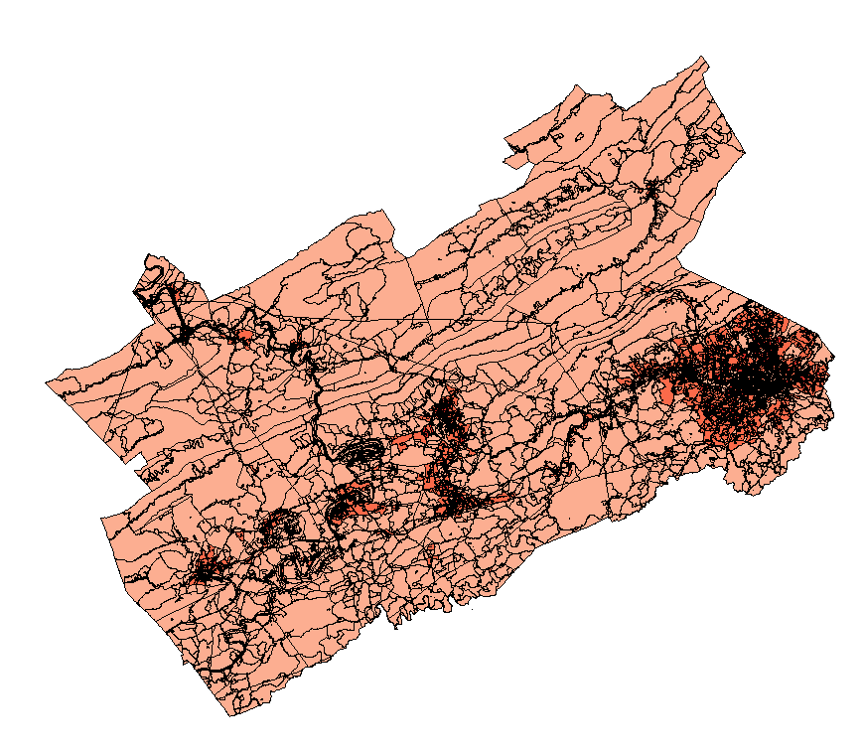

```{r setup, include=FALSE}
knitr::opts_chunk$set(echo = FALSE)
```

## Outline

- raster, terra,and mapview libraries 
  (read raster and shapefile)

- Handling spatial data in R (attributes, field calculator, select by attributes, select by location, summary statistics)

## R terra package
"Methods for spatial data analysis with vector (points, lines, polygons) and raster (grid) data. Methods for vector data include geometric operations such as intersect and buffer. Raster methods include local, focal, global, zonal and geometric operations. The predict and interpolate methods facilitate the use of regression type (interpolation, machine learning) models for spatial prediction, including with satellite remote sensing data. Processing of very large files is supported. See the manual and tutorials on <https://rspatial.org/> to get started. 'terra' replaces the 'raster' package ('terra' can do more, and it is faster and easier to use)."

## R terra package


## Examples of raster data


## Example of raster data (DEM)
```{r}
library(terra)
dem<-rast('elev.tif')
dem
plot(dem)
```

## pcp data
```{r}
a<-rast('PRISM_ppt_30yr_normal_4kmM2_annual_asc.asc')
plot(a)
```


## Example of vector data


## Example of vector data



## R sf library (Simple Features for R)

<div style="font-size: 14px;">

## R sf library (simple feature)
### Represents simple features as records in a data.frame or tibble with a geometry list-column

### Represents natively in R all 17 simple feature types for all dimensions (XY, XYZ, XYM, XYZM)

### Interfaces to GEOS for geometrical operations on projected coordinates, and (through R package s2) to s2geometry for geometrical operations on ellipsoidal coordinates

### Interfaces to GDAL, supporting all driver options, Date and POSIXct and list-columns

### Interfaces to PROJ for coordinate reference system conversion and transformation

### Uses well-known-binary serialisations written in C++/Rcpp for fast I/O with GDAL and GEOS

### Reads from and writes to spatial databases such as PostGIS using DBI

### Source: <https://r-spatial.github.io/sf/>

</div>


## Read a shapefile (y2010.shp)  
```{r, echo=TRUE}
library(sf)
pophu <- st_read('y2010.shp')
```
## data frame (attribute table)
```{r}
head(pophu)
```

## plot the sf data frame
```{r}
plot(pophu["POP10"])
```


## Mapview 



## A quick demo on mapview usage


## Outline

- raster, terra,and mapview libraries 
  (read raster and shapefile)
<br><br> <!-- Adds extra space -->

- **<span style="color: red;">Handling spatial data in R (attributes, field calculator, select by attributes, select by location, summary statistics)</span>**

## Arcmap: add a field, field calculator 


#sf data frame - Just like the attribute table 
```{r,echo=TRUE}
head(pophu)
```

## Use st_area() function for area calculation 
add the results as a new column (new field named as area) in the attribute table
```{r, echo=TRUE}
pophu$area <- as.numeric(st_area(pophu))
head(pophu)
```

## Plot 
```{r,echo=TRUE}
plot(pophu["area"])

```

## Export data as ESRI shapefile
You can add the resultant test1.shp to ArcGIS
```{r,echo=TRUE}
st_write(pophu,'test1.shp',delete_dsn = TRUE)
```

## Housing density?



## Handling spatial data in R ( select by attributes, select by location, summary statistics)
```{r,echo=TRUE}
a<-pophu[pophu$POP10>1000,]
plot(a["POP10"])
```
## Select by location
```{r,echo=TRUE}
county<-st_read('mycounty.shp')
county_proj<-st_transform(county,crs(pophu))
pophu_withincounty<-st_intersection(pophu,county_proj)
plot(pophu_withincounty["POP10"])
```

## summary statistics
