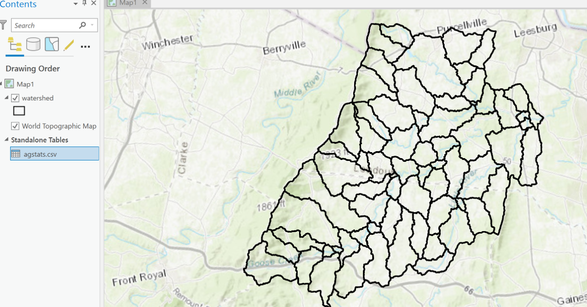

```{r setup, include=FALSE}
knitr::opts_chunk$set(echo = FALSE)
```

## Outline

Handling spatial data in R

- *Join tables (join table to shapefile)*

- <span style="color: blue;">*Select features (select by attribute)*</span>

- *Buffer (shapefile), unionSpatialPolygons*

- *Zonal statistics as table (for Raster data)*


## Join tables (join csv table to shapefile)


## Join tables (join csv table to shapefile)


## Joining CSV to Shapefile Using sf Library

### Steps to Join CSV to Shapefile
```{r, echo=TRUE, message=FALSE, warning=FALSE,  results='hide'}
library(sf)
library(dplyr)

# Load the shapefile
watershed <- st_read("watershed.shp")

# Read the CSV file
agstats <- read.csv("agstats.csv")

```
```{r,echo=TRUE, message=FALSE, warning=FALSE}
# Assuming both data frames have a common key named "Subbasin"
joined_data <- left_join(watershed,agstats,by='Subbasin')

# Display the first few rows of the joined data
names(joined_data)

# Plot the joined data
plot(joined_data["MEAN"])
```


## Outline

Handling spatial data in R

- *Join tables (join table to shapefile)*

- <span style="color: blue;">*Select features (select by attribute)*</span>

- *Buffer (shapefile), unionSpatialPolygons*

- *Zonal statistics as table (for Raster data)*


## Example (select by attribute)

Each point has columns (i.e., 'V') indicating storm surge height


```{r,echo=TRUE, message=FALSE, warning=FALSE}

storm <- st_read('stormsub.shp')
plot(storm['V'])
```

## Select points based on user-defined threshold value? (e.g, >1.6m)
```{r,echo=TRUE, message=FALSE, warning=FALSE}

storm_new <- storm[storm$V>1.0&storm$V<1.5,]
plot(storm_new['V'])
```

## Outline

Handling spatial data in R

- *Join tables (join table to shapefile)*

- <span style="color: blue;">*Select features (select by attribute)*</span>

- *Buffer (shapefile), unionSpatialPolygons*

- *Zonal statistics as table (for Raster data)*


## Buffer (shapefile)

```{r,echo=TRUE, message=FALSE, warning=FALSE}
library(terra)
dem<-rast('dem.tif')
stream<-st_read('stream.shp')
plot(dem)
plot(stream,add=T)
```

## Add 90m buffer

```{r,echo=TRUE, message=FALSE, warning=FALSE}
buffer_90m <- st_buffer(stream, dist = 900)
plot(dem)
plot(stream,add=T)
# Plot the buffer on top of the DEM and stream
plot(buffer_90m, add=TRUE, border='blue')
```

## Vary buffer size based on stream attribute

```{r,echo=TRUE, message=FALSE, warning=FALSE}
# Create varying size buffers based on stream$Wid2
buffers <- st_buffer(stream, dist = stream$Wid2 *10)
plot(dem)
# Plot the buffers on top of the DEM and stream
plot(buffers, add=TRUE, border='red')
```

## Outline

Handling spatial data in R

- *Join tables (join table to shapefile)*

- <span style="color: blue;">*Select features (select by attribute)*</span>

- *Buffer (shapefile), unionSpatialPolygons*

- *Zonal statistics as table (for Raster data)*

## st_union function
```{r,echo=TRUE, message=FALSE, warning=FALSE}
plot(st_geometry(watershed))
# Use st_union to merge polygons 
merged_watershed <- st_union(watershed)
plot(merged_watershed)
```

## Outline

Handling spatial data in R

- *Join tables (join table to shapefile)*

- <span style="color: blue;">*Select features (select by attribute)*</span>

- *Buffer (shapefile), unionSpatialPolygons*

- *Zonal statistics as table (for Raster data)*


## Zonal stats as table
### Mean elevation for each block group?

### Other examples?


## Example
```{r,echo=TRUE, message=FALSE, warning=FALSE}
dem <-rast('dem.tif')
plot(dem)
watershed <- st_read('watershed.shp')
plot(st_geometry(watershed),add=T)
zonal_stats <- terra::extract(dem, watershed, fun = mean, na.rm = TRUE)
```

## Zonal stats (example)
```{r,echo=TRUE, message=FALSE, warning=FALSE}
zonal_stats <- terra::extract(dem, watershed, fun = mean, na.rm = TRUE)
head(zonal_stats)
```

## Zonal stats (example)
```{r,echo=TRUE, message=FALSE, warning=FALSE}
watershed_dem <- cbind(watershed, zonal_stats)
head(watershed_dem)
```
## Zonal stats (example)
```{r,echo=TRUE, message=FALSE, warning=FALSE}
plot(watershed_dem['dem'])
```


