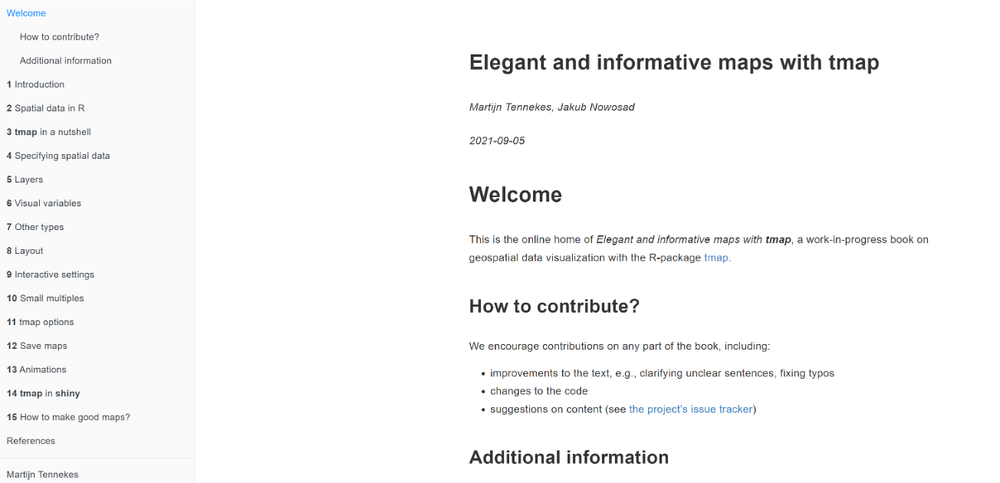
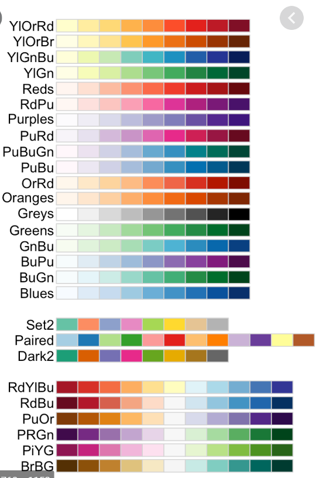
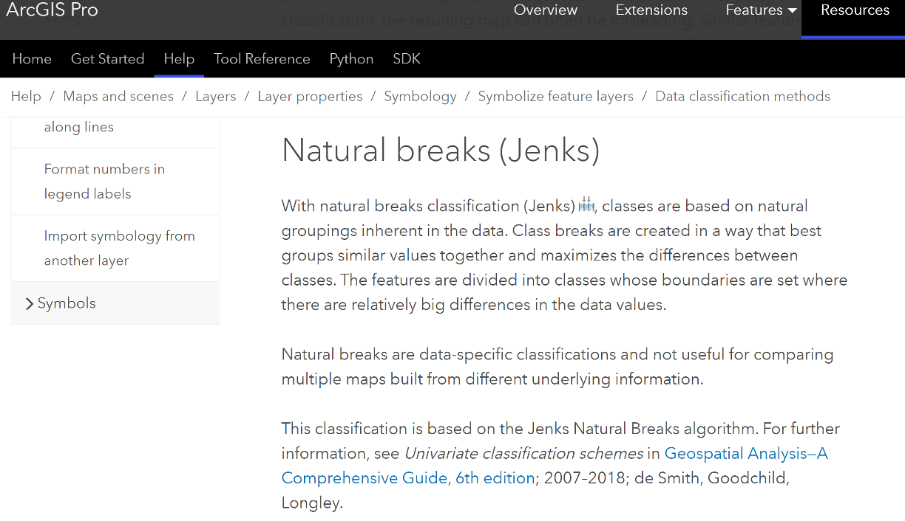
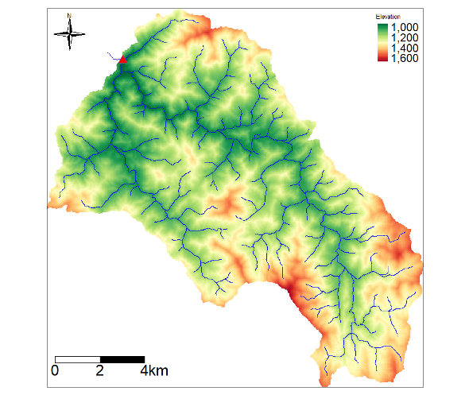

```{r setup, include=FALSE}
knitr::opts_chunk$set(echo = FALSE)
```

## Create maps in R

- *tmap (tmap is an R package for visualization spatial data)*  
  https://r-tmap.github.io/tmap-book/index.html

<br>

<br>

- *ggplot2 library (data visualization; one of the most popular packages in R)*  
  https://r4ds.had.co.nz/data-visualisation.html
  
## tmap
Tennekes M (2018). “tmap: Thematic Maps in R.” Journal of Statistical Software,84(6), 1–39.doi:10.18637/jss.v084.i06.



## tmap

- tmap works well with vector data (sf library) and raster data (terra library)

<br>

- The spatial data can be used to create simple, quick maps (qtm) and more complex and expandable maps.

<br>

- These maps can be presented in two modes as a static map and an interactive one:

  *tmap_mode('plot')* or *tmap_mode('view')*

## tmap - quick maps
```{r, echo=TRUE, message=FALSE, warning=FALSE}
library(sf)
library(tmap)
# Load the shapefile
income_va <- st_read("income.shp")
# qtm is good for data exploration, simple maps only
qtm(income_va, fill='income')
```

## tmap – regular maps
“The first element always is tm_shape(), which specified the input shape object. 
Next, map layers, additional map elements, and overall layout can be customized.”
```{r,echo=TRUE, message=FALSE, warning=FALSE}
tm_shape(income_va)+
	tm_polygons("income",palette = c("yellow", "darkgreen"))+
  tm_layout(title='Income for VA',legend.text.size = 0.5)
```


## tmap – regular maps
### Select color for your map



## Map title, scale bar, and north arrow 
```{r,echo=TRUE, message=FALSE, warning=FALSE}
tm_shape(income_va)+
	tm_polygons("income",palette=c('yellow','darkgreen'))+
  tm_layout(title='Income for VA',
            title.position=c("center","top"),
            legend.text.size = 0.5,
            legend.position=c("left","top"))+
  tm_scale_bar(breaks = c(0, 10,20), text.size = 0.5, position=c("right", "bottom"))+
  tm_compass(type = "4star", size = 3, position = c("right", "top"))

```


## tmap – regular maps

```{r,echo=TRUE, message=FALSE, warning=FALSE}
tm_shape(income_va)+
	tm_symbols("income")+
  tm_layout(title='Income for VA',legend.text.size = 0.5)
```

##  Mapping values (e.g., population) into user-defined groups (Natural breaks or Jenks)


## Example uisng tmap
```{r,echo=TRUE, message=FALSE, warning=FALSE}
tm_shape(income_va) + 
  tm_polygons("income", style = "jenks",n=7) + 
  tm_layout(title = "Income with Natural Breaks")

```

## Mapping with raster data (continuous variable)
```{r,echo=TRUE, message=FALSE, warning=FALSE}
library(terra)
dem<-rast('dem.tif')
tm_shape(dem) + 
  tm_raster(style = "cont", palette = "-RdYlGn") 
```

## Mapping with raster data (categorical variable)
```{r,echo=TRUE, message=FALSE, warning=FALSE}
nlcd<-rast('nlcd.tif')
# Define the palette and labels
pal4 <- c("blue", "red", "green", "yellow") 
# Example colors, adjust as needed
labels <- c('water', 'urban', 'forest', 'ag')

# Create the map
tm_shape(nlcd) + 
  tm_raster(style = "cat", palette = pal4, labels = labels) +
  tm_layout(legend.text.size = 0.8, legend.position = c("right", "bottom"))

```


## Three layers (usgs site, streams, and dem)



## Create maps in R

- *tmap (tmap is an R package for visualization spatial data)*  
  https://r-tmap.github.io/tmap-book/index.html

<br>

<br>

- *ggplot2 library (data visualization; one of the most popular packages in R)*  
  https://r4ds.had.co.nz/data-visualisation.html
  
## Using ggplot2
```{r,echo=TRUE, message=FALSE, warning=FALSE}
library(ggplot2)
# Basic map using ggplot2
ggplot(data = income_va) +
  geom_sf() +
  labs(title = "Income data of Virginia")
```
## ggplot2- Custom Styling
```{r,echo=TRUE, message=FALSE, warning=FALSE}
library(ggplot2)
# Basic map using ggplot2
ggplot(data=income_va)+
geom_sf(aes(fill = income)) +
  scale_fill_viridis_c(option = "plasma") +
  theme_minimal() +
  labs(title = "Map of VA by Income",
       fill = "Income")
```

## north arrow and scale bar using the ggspatial package
```{r,echo=TRUE, message=FALSE, warning=FALSE}
library(ggplot2)
library(ggspatial)

# Define margins to make space for the scale bar
plot_margin <- theme(plot.margin = unit(c(1, 1, 1, 1), "cm"))

# Basic map with north arrow and scale bar placed outside the plotting area
ggplot(data = income_va) +
  geom_sf(aes(fill = income)) +
  scale_fill_viridis_c(option = "plasma") +
  annotation_scale(location = "bl", width_hint = 0.5, 
                   pad_x = unit(0.5, "in"), pad_y = unit(0, "in"), 
                   height = unit(0.2, "cm")) +
  annotation_north_arrow(location = "tl", which_north = "true", 
                         pad_x = unit(0.1, "in"), pad_y = unit(0, "in"),
                         style = north_arrow_fancy_orienteering) +
  labs(title = "Map of Income distribution, VA") +
  plot_margin
```

